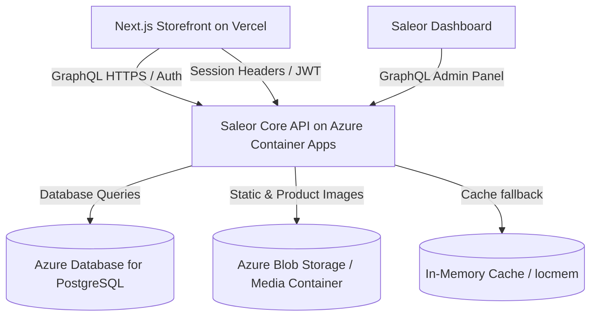

# AMTS Technical Assignment: Saleor E-Commerce Stack (Azure Edition)

This repository contains the complete implementation of the **AMTS Technical Assignment**. It integrates the **Saleor Core (Django)** backend and the **Saleor Storefront (Next.js)** into a unified local stack running via Docker Compose, fully configured and deployed on **Microsoft Azure** and **Vercel**.

---

## 🔗 Live Deployments

- **Backend GraphQL API (Azure)**: [https://saleor-api.wittybay-989e7f74.uaenorth.azurecontainerapps.io/graphql/](https://saleor-api.wittybay-989e7f74.uaenorth.azurecontainerapps.io/graphql/)
- **Next.js Storefront (Vercel)**: [https://storefront-om9i8w6bm-iftikar-alams-projects.vercel.app/](https://storefront-om9i8w6bm-iftikar-alams-projects.vercel.app/)
- **Admin Superuser Credentials**:
  - **Email**: `admin@example.com`
  - **Password**: `admin`

---

## 🏛️ Project Architecture



---

## 🌐 Architectural Decisions & Selection of Azure Services

1. **Backend Hosting: Azure Container Apps (ACA)**
   - **Selection**: Deployed the Saleor Core container to Azure Container Apps.
   - **Rationale**: ACA is a modern, serverless container platform built on Kubernetes (K8s) and KEDA. It abstracts infrastructure management, enforces HTTPS by default, supports scaling to zero (saving costs for inactive deployments), and handles revisions out of the box. This provides a production-ready setup without the operational complexity of managing a virtual machine or a full AKS cluster.
2. **Database: Azure Database for PostgreSQL (Flexible Server)**
   - **Selection**: Configured a Flexible Server PostgreSQL instance (v15).
   - **Rationale**: Fully managed, production-grade Postgres service. The "Flexible Server" deployment option offers custom maintenance windows, zone-redundancy, and automatic backups.
3. **Storage: Azure Blob Storage**
   - **Selection**: Configured hot tier Azure Blob Storage.
   - **Rationale**: Headless commerce requires highly durable, low-latency, and cost-efficient asset distribution. Static and media assets are routed to public containers (`media` and `private` containers) using the Django Storage backend configured dynamically via the environment.
4. **CI/CD: GitHub Actions**
   - **Selection**: Standardized on GitHub Actions for pipeline automation.
   - **Rationale**: Seamlessly integrates with the workspace, automatically runs our GraphQL unit tests, builds the Docker image, pushes it to Azure Container Registry (ACR), and triggers ACA to deploy the new container revision upon pushing to the `main` branch.
5. **Storefront Hosting: Vercel**
   - **Selection**: Deployed the Next.js Storefront to Vercel.
   - **Rationale**: Next.js is optimized for Vercel, providing instant serverless routing, Edge optimization, and optimal build caching out of the box.

---

## 📝 Changelog & Modification Rationale

### 1. Backend Core (`saleor` - Django)

- **Configuration Switch (`django-environ`)**: Refactored [settings.py](file:///c:/Users/iftik/OneDrive/Desktop/AMTS/AMTS/saleor/saleor/settings.py) to parse environments through `django-environ`. This enables seamless secret injection (`DATABASE_URL`, `AZURE_STORAGE_CONNECTION_STRING`, etc.) and isolates configuration variables from the source code.
- **Windows Host Support**: Refactored `saleor/core/rlimit.py` to handle `ModuleNotFoundError` on Windows systems (where the Unix-specific `resource` module is missing). This allows native development and tests to run locally on Windows machines.
- **Docker Mount Optimization**: Optimized the `Dockerfile` and `docker-compose.yml` to use standard Docker volume synchronization instead of read-only bind mounts, resolving package synchronization collisions in some Docker Desktop runtimes.

### 2. Azure-Specific Bug Fixes

- **Database Seeding Fix (`random_data.py`)**:
  - _Problem_: The seeding command (`populatedb`) failed on Azure with an `IntegrityError: null value in column "site_id"`. This was due to the seeding script only checking Django field `.name` properties during fixture JSON importing, which filtered out foreign keys like `site_id`, `top_menu_id`, and `bottom_menu_id`.
  - _Fix_: Modified [random_data.py](file:///c:/Users/iftik/OneDrive/Desktop/AMTS/AMTS/saleor/saleor/core/utils/random_data.py#L1792-L1804) to include `f.attname` in the valid fields check, allowing Django relationship database columns to seed properly.
- **Throttling/Redis Cache Fallback (`settings.py`)**:
  - _Problem_: User logins crashed with `redis.exceptions.ConnectionError: Error 111 connecting to localhost:6379`. The authentication endpoint uses throttling, which queries Django's default cache. Since Redis is not deployed on Azure, it crashed.
  - _Fix_: Implemented dynamic cache routing in [settings.py](file:///c:/Users/iftik/OneDrive/Desktop/AMTS/AMTS/saleor/saleor/settings.py#L988-L995). If the app runs on Azure (presence of `AZURE_STORAGE_CONNECTION_STRING`) and the cache targets a local address, it overrides the engine to fall back to Django's in-memory local cache (`locmem://`).

### 3. "Recently Viewed Products" Feature (End-to-End)

- **Database Model**: Created a `RecentlyViewedProduct` model in [product/models.py](file:///c:/Users/iftik/OneDrive/Desktop/AMTS/AMTS/saleor/saleor/product/models.py) linking a product with a `user` (for authenticated flows) or `session_key` (for anonymous flows), alongside a `viewed_at` timestamp.
- **FIFO rolling Capping Manager**: Implemented `RecentlyViewedProductManager` to automatically prune the database history when a new view is registered, ensuring exactly the **last 5 viewed products** are maintained per user/session.
- **GraphQL API endpoints**:
  - `recordProductView` Mutation: Safely registers a product view server-side, linking it either to the authenticated user token or an anonymous session cookie.
  - `recentlyViewedProducts` Query: Retrieves the last 5 viewed products with full product details (name, price, images).
- **Next.js Storefront Components**:
  - Created `RecentlyViewedTracker` which issues the mutation asynchronously on PDP (Product Detail Page) loads.
  - Created the `RecentlyViewed` premium slider component styled in CSS, rendering recently viewed products fetched server-side from the GraphQL query.

---

## 🚀 Local Development Setup

Follow these steps to run the entire e-commerce stack locally:

### Prerequisites

- Docker & Docker Compose
- Node.js v18+ & pnpm (`npm install -g pnpm`)
- Python 3.12+ (optional, for local non-docker development)

### Step 1: Clone and Spin Up the Infrastructure

1. Clone the repository and navigate to the project directory.
2. Spin up the backend containers (PostgreSQL, Redis, Saleor API, and Saleor Dashboard):
   ```bash
   docker compose up -d
   ```

### Step 2: Initialize the Database

1. Run Django migrations to create the database schema:
   ```bash
   docker compose run --rm api python manage.py migrate
   ```
2. Seed the database with sample products and create the default admin account:
   ```bash
   docker compose run --rm api python manage.py populatedb --createsuperuser
   ```
   - _Admin User_: `admin@example.com` / `admin`

### Step 3: Run the Next.js Storefront

1. Navigate to the storefront directory:
   ```bash
   cd storefront
   ```
2. Install the packages:
   ```bash
   pnpm install
   ```
3. Generate the GraphQL TypeScript types (which introspects the running Saleor API):
   ```bash
   pnpm run generate:all
   ```
4. Start the storefront development server:
   ```bash
   pnpm run dev
   ```

- Storefront: `http://localhost:3000`
- Saleor GraphQL API: `http://localhost:8000/graphql/`
- Saleor Dashboard (Admin panel): `http://localhost:9000`

---

## 🧪 Running Automated Tests

We wrote full integration tests for the "Recently Viewed" database manager and GraphQL endpoints. To execute them inside the local container:

```bash
docker compose run --rm api pytest saleor/graphql/product/tests/test_recently_viewed.py
```

---

## ⚠️ Trade-offs & Limitations

1. **Local Memory Cache Fallback on Azure**
   - _Trade-off_: We fell back to Django's `locmem://` cache backend instead of spinning up Azure Cache for Redis.
   - _Limitation_: Because `locmem` keeps cache in the container's memory, if the Container App scales horizontally to multiple replicas, the throttling cache is not shared. For production high-traffic scaling, an Azure Cache for Redis instance should be provisioned and configured.
2. **Anonymous Session Key Generation**
   - _Trade-off_: Anonymous session keys are generated by the storefront and passed via request headers.
   - _Limitation_: If the user clears their browser cookies/storage, their anonymous session history is lost.
3. **Synchronous Product View Writes**
   - _Trade-off_: Product views are written to the database synchronously on the request thread.
   - _Limitation_: For massive write-heavy environments, this could introduce slight query overhead. In a larger production deployment, view writes should be offloaded to Celery background tasks or an asynchronous message queue.
